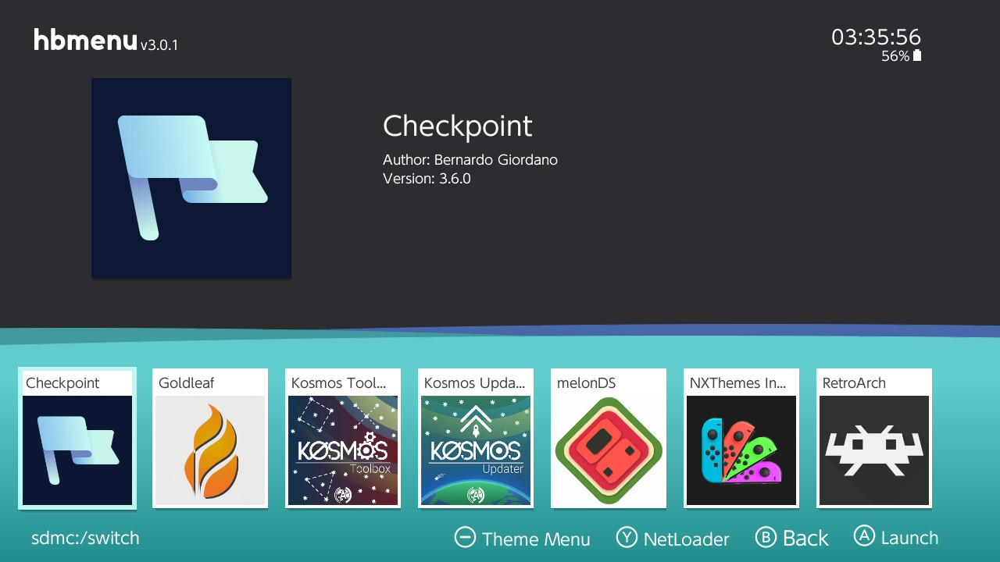
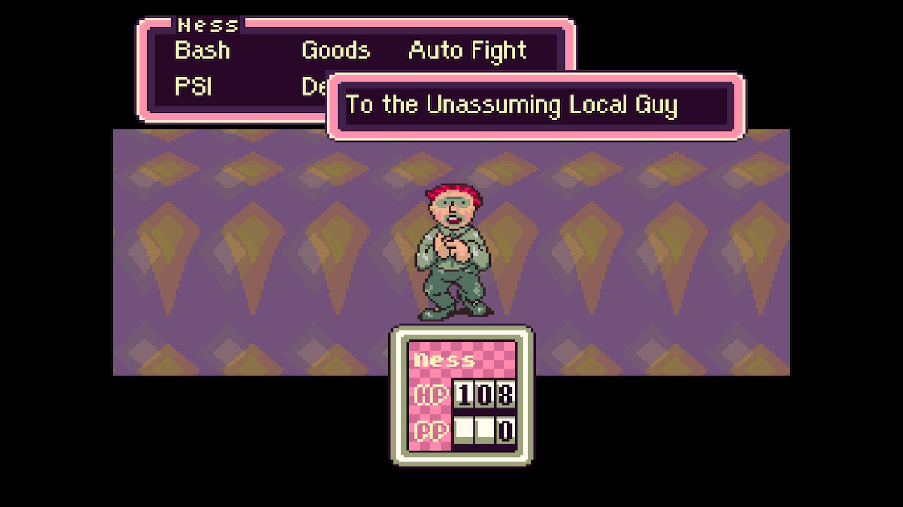
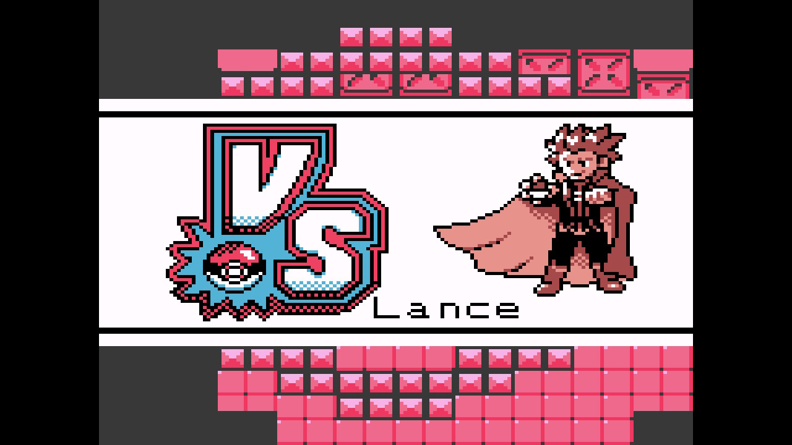

<h1 align=center> switch </h1>

  

  
  

## setup

This includes the following packages:

- Atmosphere
    - [Kosmos Toolbox](https://github.com/AtlasNX/Kosmos-Toolbox): cfw-package configuration
    - [Homebrew Menu](https://github.com/switchbrew/nx-hbmenu): menu to launch NRO homebrew
- Utilities
    - [Checkpoint](https://github.com/FlagBrew/Checkpoint): a save manager
    - [Goldleaf](https://github.com/XorTroll/Goldleaf): next-generation tinfoil (NSP installer), currently used as a file manager
- [Retroarch](https://www.retroarch.com/)
    - Stella: Atari 2600 core
    - Prosystem: Atari 7800 core
    - Nestopia: NES core
    - SNES9x2010: SNES core
    - Mupen64Plus Next: (experimental) N64 core
    - Gambatte: Game Boy and Game Boy Color core
    - mGBA: Game Boy Advance core
- melonDS (Generic's JIT improvements should come soon): DS emulator, sorta
    - https://github.com/Arisotura/melonDS
    - https://github.com/Arisotura/melonDS/tree/jit_master_merge
    - https://github.com/Hydr8gon/melonDS

Currently broken under Atmosphere 0.10.0:
    - [Atmosphere-Updater](https://github.com/ITotalJustice/atmosphere-updater): an unofficial updater for Atmosphere
https://github.com/FuryBaguette/AmiiSwap
- [emuiibo](https://github.com/XorTroll/emuiibo/): allows emulation of amiibo within games
    - [sys-clk](https://github.com/retronx-team/sys-clk/): allows overclocking
    - [sys-ftpd](https://github.com/jakibaki/sys-ftpd): background FTP server for managing files
    - [ldn_mitm](https://github.com/spacemeowx2/ldn_mitm): ad-hoc local multiplayer titles with switch-lan-play
sys-con?
ulaunch?
